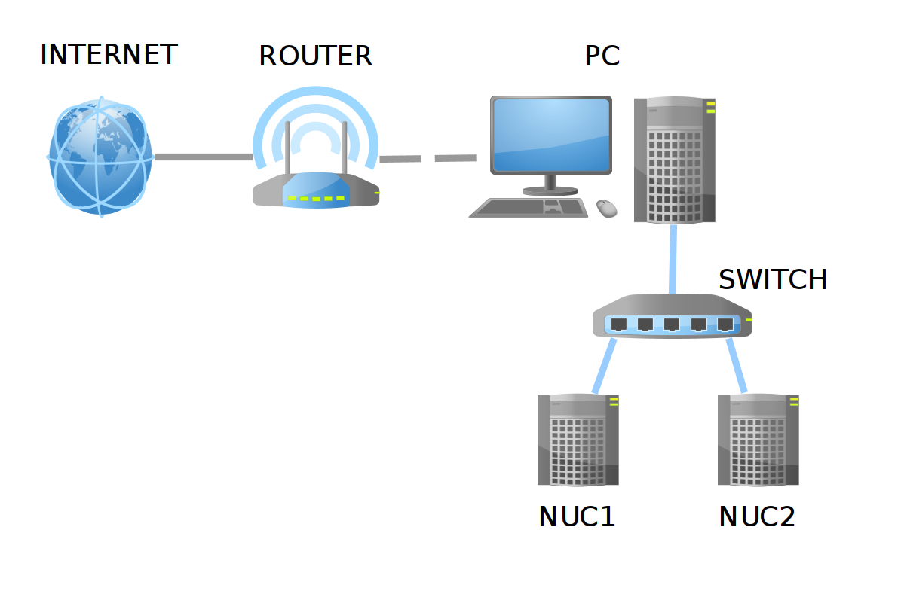
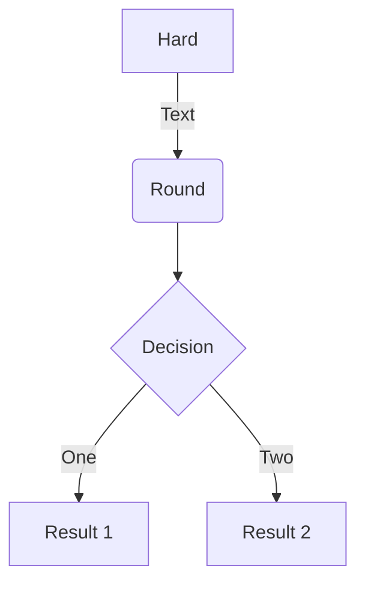
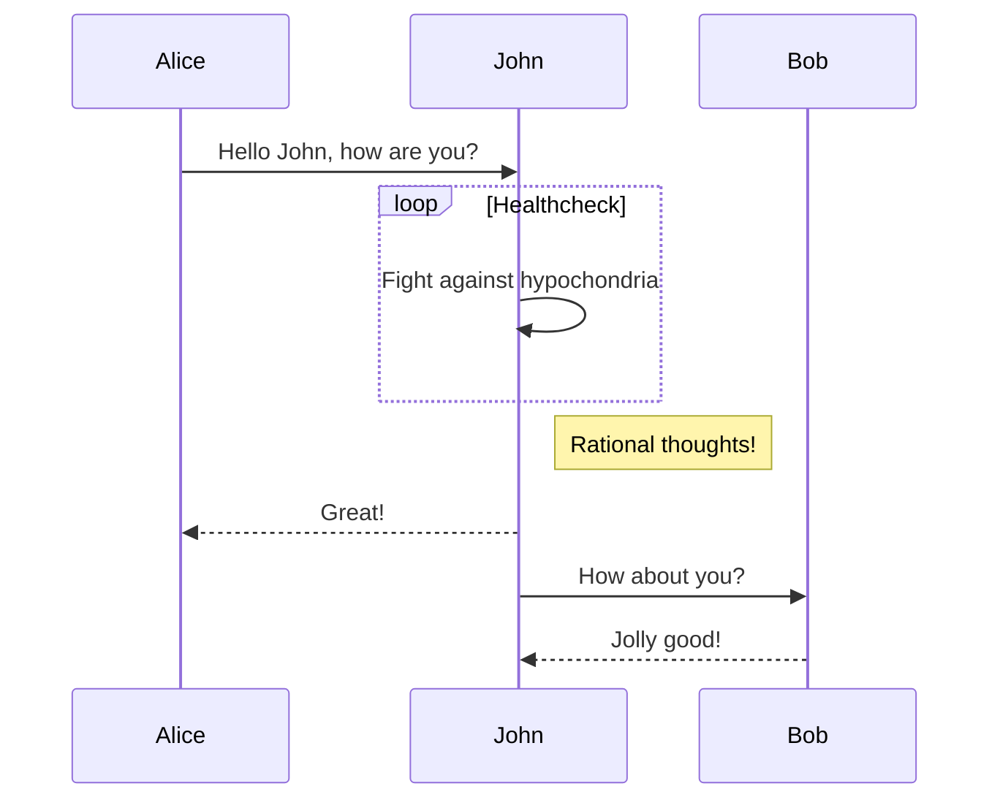
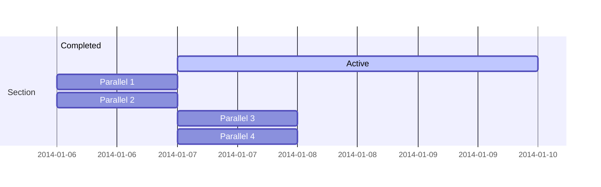
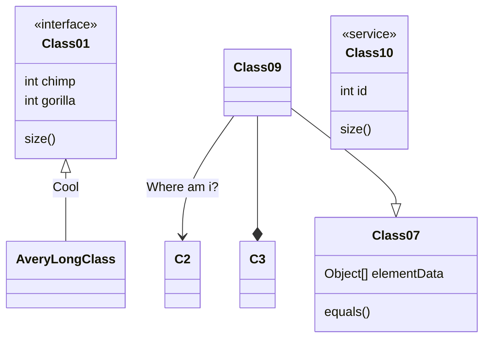
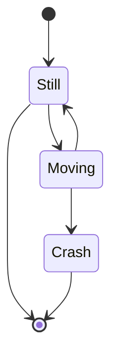

## Preamble

I have a little but nice HP ENVY model *TE01-0008ns* with 32 GB RAM, 8 CPUs, and 3TB of hard disk running Ubuntu 20.04 that I use to do all my computational work (and most of my tweeting). A few months ago I connected it with my two laptops (one of them deceased now, RIP my dear *skynet*) to create a little cluster to run parallel tasks in R.



It was just a draft cluster running on WIFI, but it served me to think about getting a more permanent solution not requiring two additional laptops in my desk.

That's were the nice INTEL NUCs (from [*Next Unit of Computing*](https://en.wikipedia.org/wiki/Next_Unit_of_Computing)) come into play. NUCs are full-fledged computers fitted in small boxes usually sold without RAM memory sticks and no hard disk (henc ethe term *barebone*). Since they have a low energy consumption footprint, I thought these would be ideal units for my soon-to-be home cluster.

## Material

And so, I gifted myself with:

  + 2 [Intel Barebone BOXNUC6CAYH](https://ark.intel.com/content/www/us/en/ark/products/95062/intel-nuc-kit-nuc6cayh.html), each with 4 cores, and a maximum RAM memory of 32GB (you might read they only accept 8GB, but that's not the case anymore). Notice that these NUCs aren't state-of-the-art now, they were released by the end of 2016.
  + 2 Hard disks SSD 2.5" [Western Digital WDS250G2B0A WD Blue](https://shop.westerndigital.com/es-es/products/internal-drives/wd-blue-sata-ssd#WDS250G2B0A) (250GB)
  + 4 Crucial CT102464BF186D DDR3 SODIMM (204 pins) RAM sticks with 8GB each. 
  + 1 ethernet switch Netgear GS308-300PES with 8 ports.
  + 3 ethernet wires NanoCable 10.20.0400-BL of cat 6 quality.
  
The whole set came to cost around 530€, but please notice that I had a clear goal in mind: duplicating my computing power with the minimum number of NUCs, while preserving a share of 4GB of RAM memory per CPU throughout the cluster (based on the features of my desk computer). A more basic setting with more modest NUCs and smaller RAM would cost half of that.

This instructive video by [David Harry](https://www.youtube.com/channel/UCYa3XeSHenvosy5wMRpeIww) shows how to install the SSD and the RAM sticks in an Intel NUC. It really takes 5 minutes tops, one only has to be a bit careful with the RAM sticks, the pins need to go all the way in into their slots before securing the sticks in place.



## Network setting

Before starting to install an operating system in the NUCS, I prepared the network as follows:

  + My desktop PC is connected to a router via WIFI (I don't have the option to use an ethernet cable, since the router is in another floor).
  + The PC is connected with the switch through a cat6 ethernet cable.
  + Each NUC is connected to the switch through a cat6 ethernet cable.





**Highlight your code snippets, take notes on math classes, and draw diagrams from textual representation.**

On this page, you'll find some examples of the types of technical content that can be rendered with Academic.

## Examples

### Code

Academic supports a Markdown extension for highlighting code syntax. You can enable this feature by toggling the `highlight` option in your `config/_default/params.toml` file.

    ```python
    import pandas as pd
    data = pd.read_csv("data.csv")
    data.head()
    ```

renders as

```python
import pandas as pd
data = pd.read_csv("data.csv")
data.head()
```

### Math

Academic supports a Markdown extension for $\LaTeX$ math. You can enable this feature by toggling the `math` option in your `config/_default/params.toml` file.

To render *inline* or *block* math, wrap your LaTeX math with `$...$` or `$$...$$`, respectively.

Example **math block**:

```tex
$$\gamma_{n} = \frac{ 
\left | \left (\mathbf x_{n} - \mathbf x_{n-1} \right )^T 
\left [\nabla F (\mathbf x_{n}) - \nabla F (\mathbf x_{n-1}) \right ] \right |}
{\left \|\nabla F(\mathbf{x}_{n}) - \nabla F(\mathbf{x}_{n-1}) \right \|^2}$$
```

renders as

$$\gamma_{n} = \frac{ \left | \left (\mathbf x_{n} - \mathbf x_{n-1} \right )^T \left [\nabla F (\mathbf x_{n}) - \nabla F (\mathbf x_{n-1}) \right ] \right |}{\left \|\nabla F(\mathbf{x}_{n}) - \nabla F(\mathbf{x}_{n-1}) \right \|^2}$$

Example **inline math** `$\nabla F(\mathbf{x}_{n})$` renders as $\nabla F(\mathbf{x}_{n})$.

Example **multi-line math** using the `\\\\` math linebreak:

```tex
$$f(k;p_0^*) = \begin{cases} p_0^* & \text{if }k=1, \\\\
1-p_0^* & \text {if }k=0.\end{cases}$$
```

renders as

$$f(k;p_0^*) = \begin{cases} p_0^* & \text{if }k=1, \\\\
1-p_0^* & \text {if }k=0.\end{cases}$$

### Diagrams

Academic supports a Markdown extension for diagrams. You can enable this feature by toggling the `diagram` option in your `config/_default/params.toml` file or by adding `diagram: true` to your page front matter.

An example **flowchart**:

    ```mermaid
    graph TD
    A[Hard] -->|Text| B(Round)
    B --> C{Decision}
    C -->|One| D[Result 1]
    C -->|Two| E[Result 2]
    ```

renders as



An example **sequence diagram**:

    ```mermaid
    sequenceDiagram
    Alice->>John: Hello John, how are you?
    loop Healthcheck
        John->>John: Fight against hypochondria
    end
    Note right of John: Rational thoughts!
    John-->>Alice: Great!
    John->>Bob: How about you?
    Bob-->>John: Jolly good!
    ```

renders as



An example **Gantt diagram**:

    ```mermaid
    gantt
    section Section
    Completed :done,    des1, 2014-01-06,2014-01-08
    Active        :active,  des2, 2014-01-07, 3d
    Parallel 1   :         des3, after des1, 1d
    Parallel 2   :         des4, after des1, 1d
    Parallel 3   :         des5, after des3, 1d
    Parallel 4   :         des6, after des4, 1d
    ```

renders as



An example **class diagram**:

    ```mermaid
    classDiagram
    Class01 <|-- AveryLongClass : Cool
    <<interface>> Class01
    Class09 --> C2 : Where am i?
    Class09 --* C3
    Class09 --|> Class07
    Class07 : equals()
    Class07 : Object[] elementData
    Class01 : size()
    Class01 : int chimp
    Class01 : int gorilla
    class Class10 {
      <<service>>
      int id
      size()
    }
    ```

renders as



An example **state diagram**:

    ```mermaid
    stateDiagram
    [*] --> Still
    Still --> [*]
    Still --> Moving
    Moving --> Still
    Moving --> Crash
    Crash --> [*]
    ```

renders as



### Todo lists

You can even write your todo lists in Academic too:

```markdown
- [x] Write math example
- [x] Write diagram example
- [ ] Do something else
```

renders as

- [x] Write math example
- [x] Write diagram example
- [ ] Do something else

### Tables

Represent your data in tables:

```markdown
| First Header  | Second Header |
| ------------- | ------------- |
| Content Cell  | Content Cell  |
| Content Cell  | Content Cell  |
```

renders as

| First Header  | Second Header |
| ------------- | ------------- |
| Content Cell  | Content Cell  |
| Content Cell  | Content Cell  |

### Asides

Academic supports a [shortcode for asides](https://sourcethemes.com/academic/docs/writing-markdown-latex/#alerts), also referred to as *notices*, *hints*, or *alerts*. By wrapping a paragraph in `{} ... {}`, it will render as an aside.

```markdown
{}
A Markdown aside is useful for displaying notices, hints, or definitions to your readers.
{}
```

renders as

{}
A Markdown aside is useful for displaying notices, hints, or definitions to your readers.
{}

### Spoilers

Add a spoiler to a page to reveal text, such as an answer to a question, after a button is clicked.

```markdown

You found me!

```

renders as

 You found me! 

### Icons

Academic enables you to use a wide range of [icons from _Font Awesome_ and _Academicons_](https://sourcethemes.com/academic/docs/page-builder/#icons) in addition to [emojis](https://sourcethemes.com/academic/docs/writing-markdown-latex/#emojis).

Here are some examples using the `icon` shortcode to render icons:

```markdown
 Terminal  
 Python  
 R
```

renders as

 Terminal  
 Python  
 R

### Did you find this page helpful? Consider sharing it 🙌
