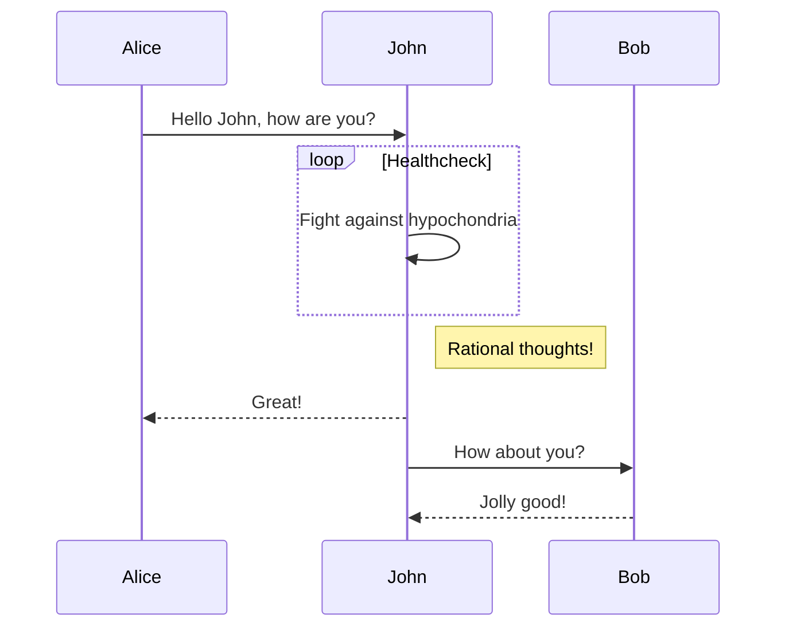
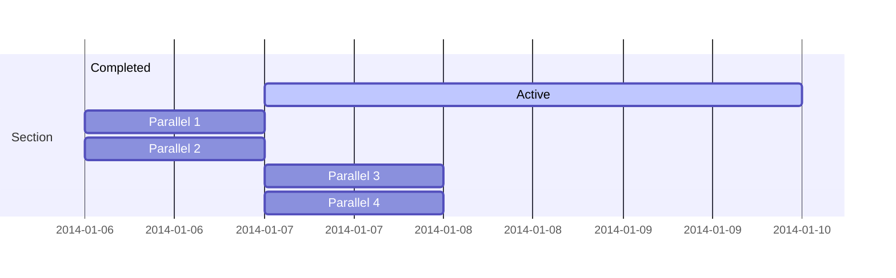
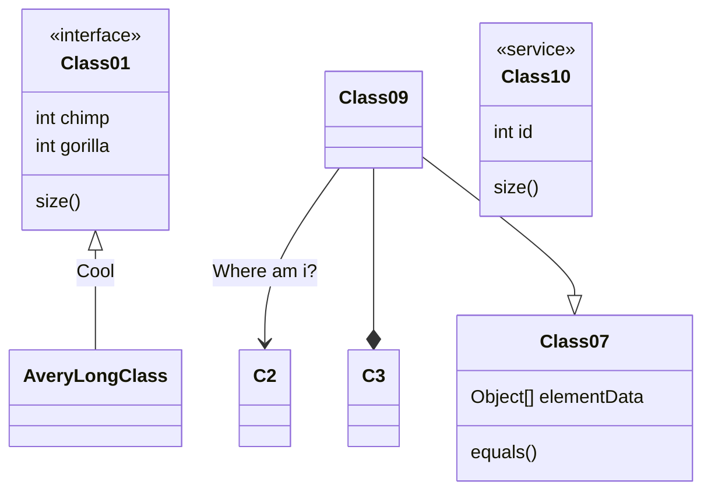
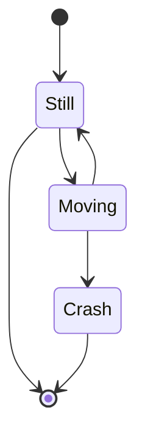

## Summary

In this post I explain how to setup a home [Beowulf cluster](https://en.wikipedia.org/wiki/Beowulf_cluster) with a personal PC with Ubuntu 20.04 (but the instructions may work for many different Linux distros) and a couple of [Intel NUCs](https://www.intel.com/content/www/us/en/products/boards-kits/nuc.html).

The topics I cover here are:

  + Required material
  + Network setting
  + Installing the secure shell protocol
  + Installing Ubuntu server in the NUCs
  + Installing R in the NUCs
  + Managing the cluster

## Preamble

I have a little but nice HP ENVY model *TE01-0008ns* with 32 GB RAM, 8 CPUs, and 3TB of hard disk running Ubuntu 20.04 that I use to do all my computational work (and most of my tweeting). A few months ago I connected it with my two laptops (one of them deceased now, RIP my dear *skynet*) to create a little cluster to run parallel tasks in R.



It was just a draft cluster running on WIFI, but it served me to think about getting a more permanent solution not requiring two additional laptops in my desk.

That's were the nice INTEL NUCs (from [*Next Unit of Computing*](https://en.wikipedia.org/wiki/Next_Unit_of_Computing)) come into play. NUCs are full-fledged computers fitted in small boxes usually sold without RAM memory sticks and no hard disk (henc ethe term *barebone*). Since they have a low energy consumption footprint, I thought these would be ideal units for my soon-to-be home cluster.

## Material

And so, I gifted myself with:

  + 2 [Intel Barebone BOXNUC6CAYH](https://ark.intel.com/content/www/us/en/ark/products/95062/intel-nuc-kit-nuc6cayh.html), each with 4 cores, and a maximum RAM memory of 32GB (you might read they only accept 8GB, but that's not the case anymore). Notice that these NUCs aren't state-of-the-art now, they were released by the end of 2016.
  + 2 Hard disks SSD 2.5" [Western Digital WDS250G2B0A WD Blue](https://shop.westerndigital.com/es-es/products/internal-drives/wd-blue-sata-ssd#WDS250G2B0A) (250GB)
  + 4 Crucial CT102464BF186D DDR3 SODIMM (204 pins) RAM sticks with 8GB each. 
  + 1 ethernet switch Netgear GS308-300PES with 8 ports.
  + 3 ethernet wires NanoCable 10.20.0400-BL of cat 6 quality.
  
The whole set came to cost around 530€, but please notice that I had a clear goal in mind: duplicating my computing power with the minimum number of NUCs, while preserving a share of 4GB of RAM memory per CPU throughout the cluster (based on the features of my desk computer). A more basic setting with more modest NUCs and smaller RAM would cost half of that.

This instructive video by [David Harry](https://www.youtube.com/channel/UCYa3XeSHenvosy5wMRpeIww) shows how to install the SSD and the RAM sticks in an Intel NUC. It really takes 5 minutes tops, one only has to be a bit careful with the RAM sticks, the pins need to go all the way in into their slots before securing the sticks in place.



## Network settings

Before starting to install an operating system in the NUCS, I setup the network as follows:

  + My desktop PC is connected to a router via WIFI and dynamic IP (DHCP).
  + The PC is connected to the switch with a cat6 ethernet wire.
  + Each NUC is connected to the switch the same kind of wire.


To share my PC's WIFI connection with the NUCs I have to prepare a new *connection profile* with the command line tool of Ubuntu's [`NetworkManager`](https://en.wikipedia.org/wiki/NetworkManager), named `nmcli`, as follows.

First, I need to find the name of my ethernet interface by checking the status of my network devices with the command line.

```bash
nmcli device status
DEVICE  TYPE      STATE        CONNECTION  
wlp3s0  wifi      connected    my_wifi 
enp2s0  ethernet  unavailable  --          
lo      loopback  unmanaged    --      
```
There I can see that my ethernet interface is named `enp2s0`. Second, I have to configure the connection.

```bash
nmcli connection add type ethernet ifname enp2s0 ipv4.method shared con-name cluster
```

Were `ifname enp2s0` is the name of the interface I want to use fo rthe new connection, `ipv4.method shared` is the type of connection, and `con-name cluster` is the name I want the connection to have. This operation adds firewall rules to manage traffic within the `cluster` network, starts a DHCP server in the computer that serves IPs to the NUCS, and a DNS server that allows the NUCs to translate internet addresses.

After turning on the switch, I can check the connection status again with

```bash
nmcli device status
DEVICE  TYPE      STATE      CONNECTION  
enp2s0  ethernet  connected  cluster     
wlp3s0  wifi      connected  my_wifi 
lo      loopback  unmanaged  --    
```

When checking the IP of the device with ```bash ifconfig``` it should yield `10.42.0.1`. Any other computer in the `cluster` network will have a dynamic IP in the range `10.42.0.1/24`

Further details about how to set a shared connection with `NetworkManager` can be found in [this nice post by Beniamino Galvani](https://fedoramagazine.org/internet-connection-sharing-networkmanager/).

## Installing OpenSSH in the PC and uploading SSH key to GitHub

My PC, as the director of the cluster, needs `SSH` running. `SSH` (**S**ecure **Sh**ell) is a remote authentication protocol that allows secure connections to remote servers that I will be using all the time to manage the cluster. To install, run, and check its status I just have to run these lines in the console:

```bash
sudo apt install ssh 
sudo systemctl enable --now ssh
sudo systemctl status ssh
```

Now, a ssh-key needs to be generated. It is a secure certificate of the identity of a given computer that allows access to remote ssh servers and services. 

```bash
ssh-keygen "label"
```

Here, I substitute "label" by the name of my computer (the one I will be using as the cluster's "director"). The system will ask for a file name and a [passphrase](https://www.ssh.com/ssh/passphrase) that will be used to encrypt the ssh-key.

COPYING THE SSH-KEY TO GITHUB

more about using ssh: https://www.digitalocean.com/community/tutorials/how-to-set-up-ssh-keys-on-ubuntu-20-04

## Installing and preparing ubuntu server in each NUC

The NUCs don't need to waste resources in a graphical interface I won't be using whatsoever. Since they will work in a *headless* configuration once the cluster is ready (no keyboard, no mouse, no display), a Linux distro without graphical user interface such as Ubuntu server is the way to go.

### Installing Ubuntu server

First it is important to connect a display, a keyboard, and a mouse to the NUC we are preparing, and turn it on while pushing F2 to start the visual BIOS. In the BIOS I have to modify these parameters.

  + Boot > OS Selection: select Linux.
  + Set USB devices to boot first.
  + Set it up to turn on automatically when it receives energy.
  + F10 to save, and shutdown.
  
To prepare the USB boot device with Ubuntu server 20.04 I first download the .iso from [here](), and use XXXX to write it to the USB stick. Plugin the stick into the NUC and reboot it.

The Ubuntu server install is pretty straightforward, and only a few things need to be decided along the way:

  + As user name I choose the same I have in my personal computer.
  + As name for the NUCs I choose "nuc1" and "nuc2", but any other option will work well.
  + As password, for comfort I use the same I have in my personal computer.
  + During the network setup, choose DHCP. If the network is properly configured and the switch is powered on, after a few seconds the NUC will acquire an IP in the range `10.42.0.1/24`, as any other machine within the `cluster` network.
  + When asked, mark the option "Install in the whole disk", unless you have other plans for your NUC.
  + Mark "Install OPenSSH".
  + Provide it with your GitHub user name if you have your ssh-key there, and it will download it right away, facilitating a lot the ssh setup.
  
Reboot once the install is completed. Now I keep configuring the NUC's operating system from my PC through ssh.

### Configuring the NUC

First, to learn the IP of the NUC:

```bash
sudo arp-scan 10.42.0.1/24
```

Other alternatives to this command are `arp -a` and `sudo arp-scan -I enp2s0 --localnet`. Once I learn the IP of the NUC, I add it to the file `etc/hosts` of my personal computer as follows.

First I open the file as root.

```bash
sudo gedit /etc/hosts
```

Add a new line there: `10.42.0.XXX nuc1` and save the file.

Now I access the NUC trough ssh to keep preparing it without a keyboard and a display. I do it from `Tilix`, that allows to open different command line tabs in the same window, which is quite handy to manage several NUCs at once.

```bash
ssh blas@10.42.0.XXX
```

The NUC's operating system probably has a bunch of pending software updates. To install these:

```bash
sudo apt-get upgrade
```

Now I have to install a set of software packages that will facilitate managing the cluster's network and the NUC itself.

```bash
sudo apt install net-tools arp-scan lm-sensors dirmngr gnupg apt-transport-https ca-certificates software-properties-common samba
```

### Setting the system time

To set the system time of the NUC to the same you have in your computer, just repeat these steps in every computer in the cluster network.

```bash
#list time zones: 
timedatectl list-timezones
#set time zone
sudo timedatectl set-timezone Europe/Madrid
#enable timesyncd
sudo timedatectl set-ntp on
```

### Setting the locale

The operating systems of the NUCs and the PC need to have the same locale. It can be set by editing the file `/etc/default/locale` with either `nano` (in the NUCS) or `gedit` (in the PC) and adding these lines, just replacing `en_US.UTF-8` with your preferred locale.

LANG="en_US.UTF-8"
LANGUAGE="en_US:en"
LC_NUMERIC="en_US.UTF-8"
LC_TIME="en_US.UTF-8"
LC_MONETARY="en_US.UTF-8"
LC_PAPER="en_US.UTF-8"
LC_IDENTIFICATION="en_US.UTF-8"
LC_NAME="en_US.UTF-8"
LC_ADDRESS="en_US.UTF-8"
LC_TELEPHONE="en_US.UTF-8"
LC_MEASUREMENT="en_US.UTF-8"


### Temperature monitoring

NUCs are prone to overheating FIND LINKS when they are under heavy loads for prolonged times. 

https://www.cyberciti.biz/faq/how-to-check-cpu-temperature-on-ubuntu-linux/

sudo apt install lm-sensors
sudo sensors-detect
sensors
watch sensors


## Installing R https://linuxize.com/post/how-to-install-r-on-ubuntu-20-04/

install deps required to add new repositories from https
sudo apt install dirmngr gnupg apt-transport-https ca-certificates software-properties-common

add cran repo
sudo apt-key adv --keyserver keyserver.ubuntu.com --recv-keys E298A3A825C0D65DFD57CBB651716619E084DAB9
sudo add-apt-repository 'deb https://cloud.r-project.org/bin/linux/ubuntu focal-cran40/'

updating repos
sudo apt update

install
sudo apt install r-base

#set locale for R (in system console)
check locale: "locale" it should be en_US.UTF-8
nano ~/.profile

add rows
export LANG=en_US.UTF-8
export LC_ALL=en_US.UTF-8

execute file
. ~/.profile

##activate firewall
sudo ufw enable

check that the computer is listening in the right ports
sudo ufw status

open ports
sudo ufw allow from 10.42.0.1 to any port 11000
sudo ufw allow from 10.42.0.1 to any port 22
sudo ufw allow ssh


##install openmpi
sudo apt install libopenmpi3 libopenmpi-dev openmpi-bin openmpi-common


**Highlight your code snippets, take notes on math classes, and draw diagrams from textual representation.**

On this page, you'll find some examples of the types of technical content that can be rendered with Academic.

## Examples

### Code

Academic supports a Markdown extension for highlighting code syntax. You can enable this feature by toggling the `highlight` option in your `config/_default/params.toml` file.

    ```python
    import pandas as pd
    data = pd.read_csv("data.csv")
    data.head()
    ```

renders as

```python
import pandas as pd
data = pd.read_csv("data.csv")
data.head()
```

### Math

Academic supports a Markdown extension for $\LaTeX$ math. You can enable this feature by toggling the `math` option in your `config/_default/params.toml` file.

To render *inline* or *block* math, wrap your LaTeX math with `$...$` or `$$...$$`, respectively.

Example **math block**:

```tex
$$\gamma_{n} = \frac{ 
\left | \left (\mathbf x_{n} - \mathbf x_{n-1} \right )^T 
\left [\nabla F (\mathbf x_{n}) - \nabla F (\mathbf x_{n-1}) \right ] \right |}
{\left \|\nabla F(\mathbf{x}_{n}) - \nabla F(\mathbf{x}_{n-1}) \right \|^2}$$
```

renders as

$$\gamma_{n} = \frac{ \left | \left (\mathbf x_{n} - \mathbf x_{n-1} \right )^T \left [\nabla F (\mathbf x_{n}) - \nabla F (\mathbf x_{n-1}) \right ] \right |}{\left \|\nabla F(\mathbf{x}_{n}) - \nabla F(\mathbf{x}_{n-1}) \right \|^2}$$

Example **inline math** `$\nabla F(\mathbf{x}_{n})$` renders as $\nabla F(\mathbf{x}_{n})$.

Example **multi-line math** using the `\\\\` math linebreak:

```tex
$$f(k;p_0^*) = \begin{cases} p_0^* & \text{if }k=1, \\\\
1-p_0^* & \text {if }k=0.\end{cases}$$
```

renders as

$$f(k;p_0^*) = \begin{cases} p_0^* & \text{if }k=1, \\\\
1-p_0^* & \text {if }k=0.\end{cases}$$

### Diagrams

Academic supports a Markdown extension for diagrams. You can enable this feature by toggling the `diagram` option in your `config/_default/params.toml` file or by adding `diagram: true` to your page front matter.

An example **flowchart**:

    ```mermaid
    graph TD
    A[Hard] -->|Text| B(Round)
    B --> C{Decision}
    C -->|One| D[Result 1]
    C -->|Two| E[Result 2]
    ```

renders as


An example **sequence diagram**:

    ```mermaid
    sequenceDiagram
    Alice->>John: Hello John, how are you?
    loop Healthcheck
        John->>John: Fight against hypochondria
    end
    Note right of John: Rational thoughts!
    John-->>Alice: Great!
    John->>Bob: How about you?
    Bob-->>John: Jolly good!
    ```

renders as



An example **Gantt diagram**:

    ```mermaid
    gantt
    section Section
    Completed :done,    des1, 2014-01-06,2014-01-08
    Active        :active,  des2, 2014-01-07, 3d
    Parallel 1   :         des3, after des1, 1d
    Parallel 2   :         des4, after des1, 1d
    Parallel 3   :         des5, after des3, 1d
    Parallel 4   :         des6, after des4, 1d
    ```

renders as



An example **class diagram**:

    ```mermaid
    classDiagram
    Class01 <|-- AveryLongClass : Cool
    <<interface>> Class01
    Class09 --> C2 : Where am i?
    Class09 --* C3
    Class09 --|> Class07
    Class07 : equals()
    Class07 : Object[] elementData
    Class01 : size()
    Class01 : int chimp
    Class01 : int gorilla
    class Class10 {
      <<service>>
      int id
      size()
    }
    ```

renders as



An example **state diagram**:

    ```mermaid
    stateDiagram
    [*] --> Still
    Still --> [*]
    Still --> Moving
    Moving --> Still
    Moving --> Crash
    Crash --> [*]
    ```

renders as



### Todo lists

You can even write your todo lists in Academic too:

```markdown
- [x] Write math example
- [x] Write diagram example
- [ ] Do something else
```

renders as

- [x] Write math example
- [x] Write diagram example
- [ ] Do something else

### Tables

Represent your data in tables:

```markdown
| First Header  | Second Header |
| ------------- | ------------- |
| Content Cell  | Content Cell  |
| Content Cell  | Content Cell  |
```

renders as

| First Header  | Second Header |
| ------------- | ------------- |
| Content Cell  | Content Cell  |
| Content Cell  | Content Cell  |

### Asides

Academic supports a [shortcode for asides](https://sourcethemes.com/academic/docs/writing-markdown-latex/#alerts), also referred to as *notices*, *hints*, or *alerts*. By wrapping a paragraph in `{} ... {}`, it will render as an aside.

```markdown
{}
A Markdown aside is useful for displaying notices, hints, or definitions to your readers.
{}
```

renders as

{}
A Markdown aside is useful for displaying notices, hints, or definitions to your readers.
{}

### Spoilers

Add a spoiler to a page to reveal text, such as an answer to a question, after a button is clicked.

```markdown

You found me!

```

renders as

 You found me! 

### Icons

Academic enables you to use a wide range of [icons from _Font Awesome_ and _Academicons_](https://sourcethemes.com/academic/docs/page-builder/#icons) in addition to [emojis](https://sourcethemes.com/academic/docs/writing-markdown-latex/#emojis).

Here are some examples using the `icon` shortcode to render icons:

```markdown
 Terminal  
 Python  
 R
```

renders as

 Terminal  
 Python  
 R

### Did you find this page helpful? Consider sharing it 🙌
