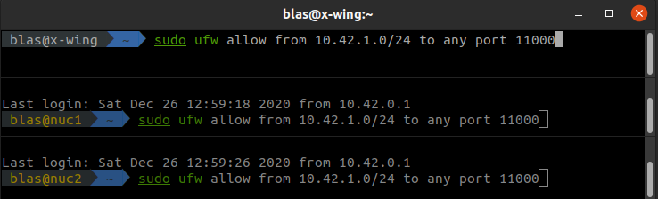
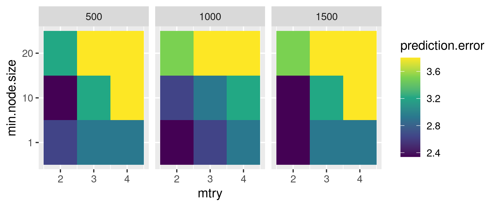
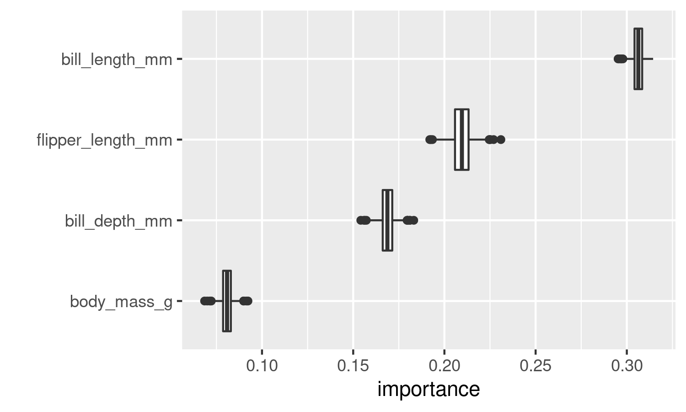

**Note:** to better follow this tutorial you can download the .Rmd file [from here](https://www.dropbox.com/s/wsl2hcex3w0lr6u/parallelized_loops.Rmd?dl=1).

In [a previous post](https://www.blasbenito.com/post/01_home_cluster/) I explained how to set up a small home cluster. Many things can be done with a cluster, and parallelizing loops is one of them. But there is no need of a cluster to parallelize loops and improve the efficiency of your coding! 

I believe that coding parallelized loops is an important asset for anyone working with R. That's why this post covers the following topics:

  + Beyond `for`: building loops with `foreach`.
  + What is a parallel backend?
  + Setup of a parallel backend for a single computer.
  + Setup for a Beowulf cluster.
  + Practical examples.
    + Tuning of random forest hyperparameters.
    + Confidence intervals of the importance scores of the predictors in random forest models.
  
&nbsp;

## `for` loops are fine, but...

Many experienced R users frequently say that nobody should write loops with R because they are tacky or whatever. However, I find loops easy to write, read, and debug, and are therefore my workhorse whenever I need to repeat a task and I don't feel like using `apply()` and the likes. However, regular `for` loops in R are highly inefficient, because they only use one of your computer cores to perform the iterations. 

For example, the `for` loop below sorts vectors of random numbers a given number of times, and will only work on one of your computer cores for a few seconds, while the others are there, procrastinating with no shame.

<div class="tenor-gif-embed" data-postid="16563810" data-share-method="host" data-width="60%" data-aspect-ratio="1.7785714285714287"><a href="https://tenor.com/view/wot-cpu-danceing-break-dancing-cool-gif-16563810">Wot Cpu GIF</a> from <a href="https://tenor.com/search/wot-gifs">Wot GIFs</a></div><script type="text/javascript" async src="https://tenor.com/embed.js"></script>

(gif kindly suggested by [Andreas Angourakis](https://twitter.com/AndrosSpica))


``` r
for(i in 1:10000){
  sort(runif(10000))
}
```

If every `i` could run in a different core, the operation would indeed run a bit faster, and we would get rid of lazy cores. This is were packages like [`foreach`](https://cran.r-project.org/web/packages/foreach) and [`doParallel`](https://cran.r-project.org/web/packages/doParallel) come into play. Let's start installing these packages and a few others that will be useful throughout this tutorial.


``` r
#automatic install of packages if they are not installed already
list.of.packages <- c(
  "foreach",
  "doParallel",
  "ranger",
  "palmerpenguins",
  "tidyverse",
  "kableExtra"
  )

new.packages <- list.of.packages[!(list.of.packages %in% installed.packages()[,"Package"])]

if(length(new.packages) > 0){
  install.packages(new.packages, dep=TRUE)
}
```

```
## Installing packages into '/home/blas/R/x86_64-pc-linux-gnu-library/4.4'
## (as 'lib' is unspecified)
```

```
## also installing the dependencies 'SQUAREM', 'diagram', 'lava', 'AsioHeaders', 'cpp11', 'prodlim', 'websocket', 'clock', 'gower', 'hardhat', 'ipred', 'timeDate', 'gargle', 'cellranger', 'ids', 'selectr', 'chromote', 'recipes', 'conflicted', 'dtplyr', 'forcats', 'googledrive', 'googlesheets4', 'haven', 'readxl', 'reprex', 'rvest', 'feather', 'mockr', 'magick', 'formattable', 'sparkline', 'webshot2'
```

```
## Warning in install.packages(new.packages, dep = TRUE): installation of package
## 'magick' had non-zero exit status
```

``` r
#loading packages
for(package.i in list.of.packages){
  suppressPackageStartupMessages(
    library(
      package.i, 
      character.only = TRUE
      )
    )
}

#loading example data
data("penguins")
```


&nbsp;

## Beyond `for`: building loops with `foreach`

The `foreach` package (the vignette is [here](https://cran.r-project.org/web/packages/foreach/vignettes/foreach.html)) provides a way to build loops that support parallel execution, and easily gather the results provided by each iteration in the loop. 

For example, this classic `for` loop computes the square root of the numbers 1 to 5 with `sqrt()` (the function is vectorized, but let's conveniently forget that for a moment). Notice that I have to create a vector `x` to gather the results before executing the loop.


``` r
x <- vector()
for(i in 1:10){
  x[i] <- sqrt(i)
  }
x
```

```
##  [1] 1.000000 1.414214 1.732051 2.000000 2.236068 2.449490 2.645751 2.828427
##  [9] 3.000000 3.162278
```

The `foreach` version returns a list with the results automatically. Notice that `%do%` operator after the loop definition, I'll talk more about it later.


``` r
x <- foreach(i = 1:10) %do% {
  sqrt(i)
  }
x
```

```
## [[1]]
## [1] 1
## 
## [[2]]
## [1] 1.414214
## 
## [[3]]
## [1] 1.732051
## 
## [[4]]
## [1] 2
## 
## [[5]]
## [1] 2.236068
## 
## [[6]]
## [1] 2.44949
## 
## [[7]]
## [1] 2.645751
## 
## [[8]]
## [1] 2.828427
## 
## [[9]]
## [1] 3
## 
## [[10]]
## [1] 3.162278
```
We can use the `.combine` argument of `foreach` to arrange the list as a vector. Other options such as `cbind`, `rbind`, or even custom functions can be used as well, only depending on the structure of the output of each iteration.


``` r
x <- foreach(
  i = 1:10, 
  .combine = 'c'
) %do% {
    sqrt(i)
  }
x
```

```
##  [1] 1.000000 1.414214 1.732051 2.000000 2.236068 2.449490 2.645751 2.828427
##  [9] 3.000000 3.162278
```

Another interesting capability of `foreach` is that it supports several iterators of the same length at once. Notice that the values of the iterators are not combined. When the first value of one iterator is being used, the first value of the other iterators will be used as well.


``` r
x <- foreach(
  i = 1:3, 
  j = 1:3, 
  k = 1:3, 
  .combine = 'c'
  ) %do% {
  i + j + k
  }
x
```

```
## [1] 3 6 9
```

&nbsp;

## Running `foreach` loops in parallel

The `foreach` loops shown above use the operator `%do%`, that processes the tasks sequentially. To run tasks in parallel, `foreach` uses the operator `%dopar%`, that has to be supported by a parallel *backend*. If there is no parallel backend, `%dopar%` warns the user that it is being run sequentially, as shown below. But what the heck is a parallel backend?


``` r
x <- foreach(
  i = 1:10, 
  .combine = 'c'
) %dopar% {
    sqrt(i)
  }
```

```
## Warning: executing %dopar% sequentially: no parallel backend registered
```

``` r
x
```

```
##  [1] 1.000000 1.414214 1.732051 2.000000 2.236068 2.449490 2.645751 2.828427
##  [9] 3.000000 3.162278
```

&nbsp;

### What is a parallel backend?

When running tasks in parallel, there should be a *director* node that tells a group of *workers* what to do with a given set of data and functions. The *workers* execute the iterations, and the *director* manages execution and gathers the results provided by the *workers*. A parallel backend provides the means for the director and workers to communicate, while allocating and managing the required computing resources (processors, RAM memory, and network bandwidth among others).

There are two types of parallel backends that can be used with `foreach`, **FORK** and **PSOCK**.

&nbsp;

#### FORK

FORK backends are only available on UNIX machines (Linux, Mac, and the likes), and do not work in clusters [sad face], so only single-machine environments are appropriate for this backend. In a FORK backend, the workers share the same environment (data, loaded packages, and functions) as the director. This setup is highly efficient because the main environment doesn't have to be copied, and only worker outputs need to be sent back to the director.


&nbsp;

#### PSOCK 

PSOCK backends (Parallel Socket Cluster) are available for both UNIX and WINDOWS systems, and are the default option provided with `foreach`. As their main disadvantage, the environment of the director needs to be copied to the environment of each worker, which increases network overhead while decreasing the overall efficiency of the cluster. By default, all the functions available in base R are copied to each worker, and if a particular set of R packages are needed in the workers, they need to be copied to the respective environments of the workers as well. 

[This post](https://www.r-bloggers.com/2019/06/parallel-r-socket-or-fork/) compares both backends and concludes that FORK is about a 40% faster than PSOCK. 


&nbsp;

## Setup of a parallel backend

Here I explain how to setup the parallel backend for a simple computer and for a Beowulf cluster as [the one I described in a previous post]((https://www.blasbenito.com/post/01_home_cluster/)). 

### Setup for a single computer

Setting up a cluster in a single computer requires first to find out how many cores we want to use from the ones we have available. It is recommended to leave one free core for other tasks.


``` r
parallel::detectCores()
```

```
## [1] 16
```

``` r
n.cores <- parallel::detectCores() - 1
```

Now we need to define the cluster with `parallel::makeCluster()` and register it so it can be used by `%dopar%` with `doParallel::registerDoParallel(my.cluster)`. The `type` argument of `parallel::makeCluster()` accepts the strings "PSOCK" and "FORK" to define the type of parallel backend to be used.


``` r
#create the cluster
my.cluster <- parallel::makeCluster(
  n.cores, 
  type = "PSOCK"
  )

#check cluster definition (optional)
print(my.cluster)
```

```
## socket cluster with 15 nodes on host 'localhost'
```

``` r
#register it to be used by %dopar%
doParallel::registerDoParallel(cl = my.cluster)

#check if it is registered (optional)
foreach::getDoParRegistered()
```

```
## [1] TRUE
```

``` r
#how many workers are available? (optional)
foreach::getDoParWorkers()
```

```
## [1] 15
```

Now we can run a set of tasks in parallel!


``` r
x <- foreach(
  i = 1:10, 
  .combine = 'c'
) %dopar% {
    sqrt(i)
  }
x
```

```
##  [1] 1.000000 1.414214 1.732051 2.000000 2.236068 2.449490 2.645751 2.828427
##  [9] 3.000000 3.162278
```

If everything went well, now `%dopar%` should not be throwing the warning `executing %dopar% sequentially: no parallel backend registered`, meaning that the parallel execution is working as it should. In this little example there is no gain in execution speed, because the operation being executed is extremely fast, but this will change when the operations running inside of the loop take longer times to run.

Finally, it is always recommendable to stop the cluster when we are done working with it.


``` r
parallel::stopCluster(cl = my.cluster)
```


### Setup for a Beowulf cluster

This setup is a bit more complex, because it requires to open a *port* in every computer of the cluster. Ports are virtual communication channels, and are identified by a number.

First, lets tell R what port we want to use:


``` r
#define port
Sys.setenv(R_PARALLEL_PORT = 11000)

#check that it
Sys.getenv("R_PARALLEL_PORT")
```

Now, we need to open the selected port in every computer of the network. In Linux we need to setup the firewall to allow connections from the network `10.42.1.0/24` (replace this with your network range if different!) to the port `11000` by splitting the window of the [Terminator console](https://gnometerminator.blogspot.com/p/introduction.html) in as many computers available in your network (the figure below shows three, one for my PC and two for my Intel NUCs), opening an ssh session on each remote machine, and setting Terminator with *Grouping* equal to *Broadcast all* so we only need to type the commands once.



Now we have to create an object defining the IPs of the computers in the network, the number of cores to use from each computer, the user name, and the identity of the *director*. This will be the `spec` argument required by `parallel::makeCluster()` to create the cluster throughtout the machines in the network. It is a list of lists, with as many lists as nodes are defined. Each *sub-list* has a slot named *host* with the IP of the computer where the given node is, and *user*, with the name of the user in each computer.

The code below shows how this would be done, step by step. Yes, this is CUMBERSOME.


``` r
#main parameters
director <- '10.42.0.1'
nuc2 <- '10.42.0.34'
nuc1 <- '10.42.0.104'
user <- "blas"

#list of machines, user names, and cores
spec <- list(
  list(
    host = director, 
    user = user,
    ncore = 7
  ), 
  list(
    host = nuc1, 
    user = user,
    ncore = 4
  ),
  list(
    host = nuc2, 
    user = user,
    ncore = 4
  )
)

#generating nodes from the list of machines
spec <- lapply(
  spec, 
  function(spec.i) rep(
    list(
      list(
        host = spec.i$host, 
        user = spec.i$user)
      ), 
    spec.i$ncore
    )
)

#formating into a list of lists
spec <- unlist(
  spec, 
  recursive = FALSE
)
```

Generating the `spec` definition is a bit easier with the function below. 


``` r
#function to generate cluster specifications from a vector of IPs, a vector with the number of cores to use on each IP, and a user name
cluster_spec <- function(
  ips,
  cores,
  user
){
  
  #creating initial list
  spec <- list()
  
  for(i in 1:length(ips)){
    spec[[i]] <- list()
    spec[[i]]$host <- ips[i]
    spec[[i]]$user <- user
    spec[[i]]$ncore <- cores[i]
  }

  #generating nodes from the list of machines
  spec <- lapply(
    spec, 
    function(spec.i) rep(
      list(
        list(
          host = spec.i$host, 
          user = spec.i$user)
        ), 
      spec.i$ncore
      )
  )

  #formating into a list of lists
  spec <- unlist(
    spec, 
    recursive = FALSE
  )
  
  return(spec)
  
}
```

This function is also available in [this GitHub Gist](https://gist.github.com/BlasBenito/93ee54d3a98d101754aaff0d658dccca), so you can load it into your R environment by executing:


``` r
source("https://gist.githubusercontent.com/BlasBenito/93ee54d3a98d101754aaff0d658dccca/raw/de57b23740ca90bc02fbd0d5cd3551106ff2fb6d/cluster_spec.R")
```

Below I use it to generate the input to the `spec` argument to start the cluster with `parallel::makeCluster()`. Notice that I have added several arguments. 

  + The argument `outfile` determines where the workers write a log. In this case it is set to *nowhere* with the double quotes, but the path to a text file in the director could be provided here. 
  + The argument `homogeneous = TRUE` indicates that all machines have the `Rscript` in the same location. In this case all three machines have it at "/usr/lib/R/bin/Rscript". Otherwise, set it up to `FALSE`.


``` r
#generate cluster specification
spec <- cluster_spec(
  ips = c('10.42.0.1', '10.42.0.34', '10.42.0.104'),
  cores = c(7, 4, 4),
  user = "blas"
)

#setting up cluster
my.cluster <- parallel::makeCluster(
  master = '10.42.0.1', 
  spec = spec,
  port = Sys.getenv("R_PARALLEL_PORT"),
  outfile = "",
  homogeneous = TRUE
)

#check cluster definition (optional)
print(my.cluster)

#register cluster
doParallel::registerDoParallel(cl = my.cluster)

#how many workers are available? (optional)
foreach::getDoParWorkers()
```

Now we can use the cluster to execute a dummy operation in parallel using all machines in the network.


``` r
x <- foreach(
  i = 1:20, 
  .combine = 'c'
) %dopar% {
    sqrt(i)
  }
x
```

Once everything is done, remember to close the cluster.


``` r
parallel::stopCluster(cl = my.cluster)
```

&nbsp;

## Practical examples

In this section I cover two examples on how to use parallelized loops to explore model outputs:

  + Tuning random forest [*hyperparameters*](https://en.wikipedia.org/wiki/Hyperparameter_(machine_learning)) to maximize classification accuracy.
  + Obtain a confidence interval for the importance score of each predictor from a set random forest models fitted with [`ranger()`](https://github.com/imbs-hl/ranger).


In the examples I use the `penguins` data from the [`palmerpenguins`](https://github.com/allisonhorst/palmerpenguins) package to fit classification models with random forest using *species* as a response, and *bill_length_mm*, *bill_depth_mm*, *flipper_length_mm*, and *body_mass_g* as predictors. 


``` r
#removing NA and subsetting columns
penguins <- as.data.frame(
  na.omit(
    penguins[, c(
      "species",
      "bill_length_mm",
      "bill_depth_mm",
      "flipper_length_mm",
      "body_mass_g"
    )]
    )
  )
```

|species | bill_length_mm| bill_depth_mm| flipper_length_mm| body_mass_g|
|:-------|--------------:|-------------:|-----------------:|-----------:|
|Adelie  |           39.1|          18.7|               181|        3750|
|Adelie  |           39.5|          17.4|               186|        3800|
|Adelie  |           40.3|          18.0|               195|        3250|
|Adelie  |           36.7|          19.3|               193|        3450|
|Adelie  |           39.3|          20.6|               190|        3650|
|Adelie  |           38.9|          17.8|               181|        3625|
|Adelie  |           39.2|          19.6|               195|        4675|
|Adelie  |           34.1|          18.1|               193|        3475|
|Adelie  |           42.0|          20.2|               190|        4250|
|Adelie  |           37.8|          17.1|               186|        3300|
|Adelie  |           37.8|          17.3|               180|        3700|
|Adelie  |           41.1|          17.6|               182|        3200|
|Adelie  |           38.6|          21.2|               191|        3800|
|Adelie  |           34.6|          21.1|               198|        4400|
|Adelie  |           36.6|          17.8|               185|        3700|
|Adelie  |           38.7|          19.0|               195|        3450|
|Adelie  |           42.5|          20.7|               197|        4500|
|Adelie  |           34.4|          18.4|               184|        3325|
|Adelie  |           46.0|          21.5|               194|        4200|
|Adelie  |           37.8|          18.3|               174|        3400|


We'll fit random forest models with the [`ranger`](https://cran.r-project.org/package=ranger) package, which works as follows:


``` r
#fitting classification model
m <- ranger::ranger(
  data = penguins,
  dependent.variable.name = "species",
  importance = "permutation"
)

#summary
m
```

```
## Ranger result
## 
## Call:
##  ranger::ranger(data = penguins, dependent.variable.name = "species",      importance = "permutation") 
## 
## Type:                             Classification 
## Number of trees:                  500 
## Sample size:                      342 
## Number of independent variables:  4 
## Mtry:                             2 
## Target node size:                 1 
## Variable importance mode:         permutation 
## Splitrule:                        gini 
## OOB prediction error:             2.63 %
```

``` r
#variable importance
m$variable.importance
```

```
##    bill_length_mm     bill_depth_mm flipper_length_mm       body_mass_g 
##        0.30913224        0.16916726        0.20410227        0.08218859
```
The output shows that the percentage of misclassified cases is 2.63, and that *bill_length_mm* is the variable that contributes the most to the accuracy of the classification.

If you are not familiar with random forest, [this post](https://victorzhou.com/blog/intro-to-random-forests/) and the video below do a pretty good job in explaining the basics:

<iframe width="560" height="315" src="https://www.youtube.com/embed/D_2LkhMJcfY" frameborder="0" allow="accelerometer; autoplay; clipboard-write; encrypted-media; gyroscope; picture-in-picture" allowfullscreen></iframe>

### Tuning random forest hyperparameters

Random forest has several hyperparameters that influence model fit:

  + `num.trees` is the total number of trees to fit. The default value is 500.
  + `mtry` is the number of variables selected by chance (from the total pool of variables) as candidates for a tree split. The minimum is 2, and the maximum is the total number of predictors.
  + `min.node.size` is the minimum number of cases that shall go together in the terminal nodes of each tree. For classification models as the ones we are going to fit, 1 is the minimum.
  
Here we are going to explore how combinations of these values increase or decrease the prediction error of the model (percentage of misclassified cases) on the out-of-bag data (not used to train each decision tree). This operation is usually named **grid search for hyperparameter optimization**.

To create these combinations of hyperparameters we use `expand.grid()`.


``` r
sensitivity.df <- expand.grid(
  num.trees = c(500, 1000, 1500),
  mtry = 2:4,
  min.node.size = c(1, 10, 20)
)
```

| num.trees| mtry| min.node.size|
|---------:|----:|-------------:|
|       500|    2|             1|
|      1000|    2|             1|
|      1500|    2|             1|
|       500|    3|             1|
|      1000|    3|             1|
|      1500|    3|             1|
|       500|    4|             1|
|      1000|    4|             1|
|      1500|    4|             1|
|       500|    2|            10|
|      1000|    2|            10|
|      1500|    2|            10|
|       500|    3|            10|
|      1000|    3|            10|
|      1500|    3|            10|
|       500|    4|            10|
|      1000|    4|            10|
|      1500|    4|            10|
|       500|    2|            20|
|      1000|    2|            20|
|      1500|    2|            20|
|       500|    3|            20|
|      1000|    3|            20|
|      1500|    3|            20|
|       500|    4|            20|
|      1000|    4|            20|
|      1500|    4|            20|


Each row in `sensitivity.df` corresponds to a combination of parameters to test, so there are 27 models to fit. The code below prepares the cluster, and uses the ability of `foreach` to work with several iterators at once to easily introduce the right set of hyperparameters to each fitted model.

Notice how in the `foreach` definition I use the `.packages` argument to export the `ranger` package to the environments of the workers.


``` r
#create and register cluster
my.cluster <- parallel::makeCluster(n.cores)
doParallel::registerDoParallel(cl = my.cluster)
  
#fitting each rf model with different hyperparameters
prediction.error <- foreach(
  num.trees = sensitivity.df$num.trees,
  mtry = sensitivity.df$mtry,
  min.node.size = sensitivity.df$min.node.size,
  .combine = 'c', 
  .packages = "ranger"
) %dopar% {
  
  #fit model
  m.i <- ranger::ranger(
    data = penguins,
    dependent.variable.name = "species",
    num.trees = num.trees,
    mtry = mtry,
    min.node.size = min.node.size
  )
  
  #returning prediction error as percentage
  return(m.i$prediction.error * 100)
  
}

#adding the prediction error column
sensitivity.df$prediction.error <- prediction.error
```

To plot the results:


``` r
ggplot2::ggplot(data = sensitivity.df) + 
  ggplot2::aes(
    x = mtry,
    y = as.factor(min.node.size),
    fill = prediction.error
  ) + 
  ggplot2::facet_wrap(as.factor(num.trees)) +
  ggplot2::geom_tile() + 
  ggplot2::scale_y_discrete(breaks = c(1, 10, 20)) +
  ggplot2::scale_fill_viridis_c() + 
  ggplot2::ylab("min.node.size")
```


The figure shows that combinations of lower values of `min.node.size` and `mtry` generally lead to models with a lower prediction error across different numbers of trees. Retrieving the first line of `sensitivity.df` ordered by ascending `prediction.error` will give us the values of the hyperparameters we need to use to reduce the prediction error as much as possible.


``` r
best.hyperparameters <- sensitivity.df %>% 
  dplyr::arrange(prediction.error) %>% 
  dplyr::slice(1)
```


| num.trees| mtry| min.node.size| prediction.error|
|---------:|----:|-------------:|----------------:|
|       500|    2|             1|         2.339181|

### Confidence intervals of variable importance scores

Random forest has an important stochastic component during model fitting, and as consequence, the same model will return slightly different results in different runs (unless `set.seed()` or the `seed` argument of `ranger` are used). This variability also affects the importance scores of the predictors, and can be use to our advantage to assess whether the importance scores of different variables do really overlap or not.

I have written a little function to transform the vector of importance scores returned by `ranger` into a data frame (of one row). It helps arranging the importance scores of different runs into a long format, which helps a lot to plot a boxplot with `ggplot2` right away. This function could have been just some code thrown inside the `foreach` loop, but I want to illustrate how `foreach` automatically transfers functions available in the R environment into the environments of the workers when required, without the intervention of the user. The same will happen with the `best.hyperparameters` tiny data frame we created in the previous section.


``` r
importance_to_df <- function(model){
  x <- as.data.frame(model$variable.importance)
  x$variable <- rownames(x)
  colnames(x)[1] <- "importance"
  rownames(x) <- NULL
  return(x)
}
```

The code chunk below setups the cluster and runs 1000 random forest models in parallel (using the best hyperparameters computed in the previous section) while using `system.time()` to assess running time.


``` r
#we don't need to create the cluster, it is still up
print(my.cluster)
```

```
## socket cluster with 15 nodes on host 'localhost'
```

``` r
#assessing execution time
system.time(
  
  #performing 1000 iterations in parallel
  importance.scores <- foreach(
    i = 1:1000, 
    .combine = 'rbind', 
    .packages = "ranger"
  ) %dopar% {
    
    #fit model
    m.i <- ranger::ranger(
      data = penguins,
      dependent.variable.name = "species",
      importance = "permutation",
      mtry = best.hyperparameters$mtry,
      num.trees = best.hyperparameters$num.trees,
      min.node.size = best.hyperparameters$min.node.size
    )
    
    #format importance
    m.importance.i <- importance_to_df(model = m.i)
    
    #returning output
    return(m.importance.i)
    
  }
  
)
```

```
##    user  system elapsed 
##   0.331   0.061   4.283
```

The output of `system.time()` goes as follows:

  + *user*: seconds the R session has been using the CPU.
  + *system*: seconds the operating system has been using the CPU.
  + *elapsed*: the total execution time experienced by the user.

This will make sense in a minute. In the meantime, let's plot our results!


``` r
ggplot2::ggplot(data = importance.scores) + 
  ggplot2::aes(
    y = reorder(variable, importance), 
    x = importance
  ) +
  ggplot2::geom_boxplot() + 
  ggplot2::ylab("")
```



The figure shows that the variable *bill_length_mm* is the most important in helping the model classifying penguin species, with no overlap with any other variable. In this particular case, since the distributions of the importance scores do not overlap, this analysis isn't truly helpful, but now you know how to do it!

I assessed the running time with `system.time()` because `ranger()` can run in parallel by itself just by setting the `num.threads` argument to the number of cores available in the machine. This capability cannot be used when executing `ranger()` inside a parallelized `foreach` loop though, and it is only useful inside classic `for` loops. 

What option is more efficient then? The code below executes a regular `for` loop running the function sequentially to evaluate whether it is more efficient to run `ranger()` in parallel using one core per model, as we did above, or sequentially while using several cores per model on each iteration.


``` r
#list to save results
importance.scores.list <- list()

#performing 1000 iterations sequentially
system.time(
  
  for(i in 1:1000){
    
    #fit model
    m.i <- ranger::ranger(
      data = penguins,
      dependent.variable.name = "species",
      importance = "permutation",
      seed = i,
      num.threads = parallel::detectCores() - 1
    )
    
    #format importance
    importance.scores.list[[i]] <- importance_to_df(model = m.i)
    
  }
)
```

```
##    user  system elapsed 
##  44.377   3.010   9.909
```

As you can see, `ranger()` takes longer to execute in a regular `for` loop using several cores at once than in a parallel `foreach` loop using one core at once. That's a win for the parallelized loop!

We can stop our cluster now, we are done with it.


``` r
parallel::stopCluster(cl = my.cluster)
```


&nbsp;

## A few things to take in mind

As I have shown in this post, using parallelized `foreach` loops can accelerate long computing processes, even when some functions have the ability to run in parallel on their own. However, there are things to take in mind, that might vary depending on whether we are executing the parallelized task on a single computer or on a small cluster.

In a single computer, the communication between workers and the director is usually pretty fast, so there are no obvious bottlenecks to take into account here. The only limitation that might arise comes from the availability of RAM memory. For example, if a computer has 8 cores and 8GB of RAM, less than 1GB of RAM will be available for each worker. So, if you need to repeat a process that consumes a significant amount of RAM, the ideal number of cores running in parallel might be lower than the total number of cores available in your system. Don't be greedy, and try to understand the capabilities of your machine while designing a parallelized task.

When running `foreach` loops as in `x <- foreach(...){...}`, the variable `x` is receiving whatever results the workers are producing. For example, if you are only returning the prediction error of a model, or its importance scores, `x` will have a very manageable size. But if you are returning heavy objects such as complete random forest models, the size of `x` is going to grow VERY FAST, and at the end it will be competing for RAM resources with the workers, which might even crash your R session. Again, don't be greedy, and size your outputs carefully.

Clusters spanning several computers are a different beast, since the workers and the director communicate through a switch and network wires and interfaces. If the amount of data going to and coming from the workers is large, the network can get clogged easily, reducing the cluster's efficiency drastically. In general, if the amount of data produced by a worker on each iteration takes longer to arrive to the director than the time it takes the worker to produce it, then a cluster is not going to be more efficient than a single machine. But this is not important if you don't care about efficiency.

Other issues you might come across while parallelizing tasks in R are thoroughly commented in [this post](https://towardsdatascience.com/parallelization-caveats-in-r-1-the-basics-multiprocessing-and-multithreading-performance-eb584b7e850e), by Imre Gera.

That's all for now folks, happy parallelization!

