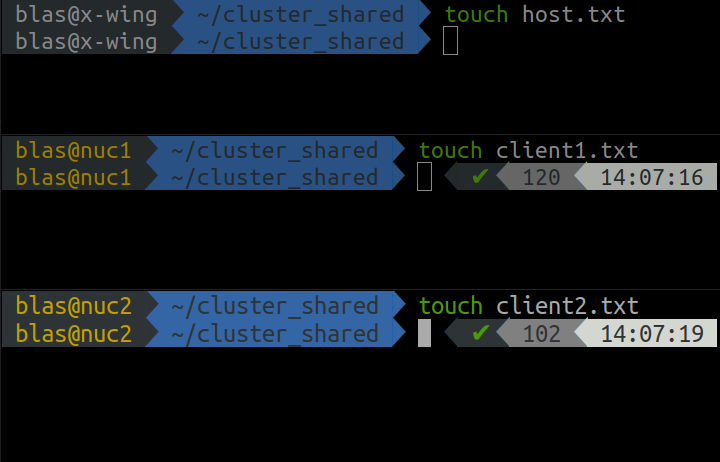
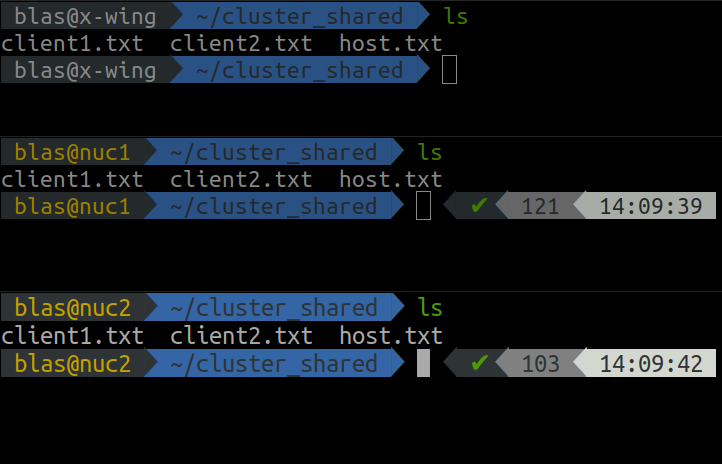

In the previous posts I have covered how to [setup a home cluster](https://www.blasbenito.com/post/01_home_cluster/), and how to [run parallel processes with `foreach` in R](https://www.blasbenito.com/post/02_parallelizing_loops_with_r/). However, so far I haven't covered how to setup a folder shared among the cluster nodes to store the results of parallel computations. 

This post (developed on Ubuntu and Ubuntu Server 20.04) assumes that the home cluster runs on Linux, and covers the following topics.

  + Basics of the Network File System protocol (NFS).
  + Setup of an NFS folder in a home cluster.
  + Using an NFS folder in a parallelized loop.
  
  
&nbsp;  

## The Network File System protocol (NFS)

The [Network File System](https://en.wikipedia.org/wiki/Network_File_System) protocol offers the means for a *host* computer to allow other computers in the network (*clients*) to read and write the contents of a given folder. The clients access such folder like if it was a local one, while in fact it is a *reference* to the one in the host computer.

The image at the beginning of the post illustrates the concept. There is a *host* computer with a folder in the path `/home/user/cluster_shared` (were `user` is your user name) that is broadcasted to the network, and there are one or several *clients* that are mounting *mounting* (making accessible) the same folder in their local paths `/home/user/cluster_shared`. 

If the host writes a file to the shared folder, it is available right away for the clients, and the other way around. At the end, the idea is to have a folder shared among all computers in the cluster, while having the same exact path on each one of them to write or read files from such shared folder.

&nbsp;  

## Setup of an NFS folder in a home cluster

To setup the shared folder we'll need to do some things in the *host*, and some things in the *clients*. Let's start with the host.

#### Preparing the host computer

First we need to install the `nfs-kernel-server`.

```{bash, eval = FALSE}
sudo apt update
sudo apt install nfs-kernel-server
```

Now we can create the shared folder. Remember to replace `user` with your user name, and `cluster_shared` with the actual folder name you want to use.

```{bash, eval = FALSE}
mkdir /home/user/cluster_shared
```

To broadcast it we need to open the file `/etc/exports`...

```{bash, eval = FALSE}
sudo gedit /etc/exports
```

... and add the following line

```{bash, eval = FALSE}
/home/user/cluster_shared IP_CLIENT1(rw,no_subtree_check) IP_CLIENT2(rw,no_subtree_check) IP_CLIENT3(rw,no_subtree_check)
```

where:

  + `/home/user/cluster_shared` is the path of the shared folder.
  + `IP_CLIENTx` are the IPs of each one of the clients.
  + `rw` gives reading and writing permission on the shared folder to the given client.
  + `no_subtree_check` prevents the host from checking the complete tree of shares before attending a request (read or write) by a client.
  
For example, the last line of my `/etc/exports` file looks like this:

```{bash, eval = FALSE}
/home/blas/cluster_shared 10.42.0.34(rw,async,no_subtree_check) 10.42.0.104(rw,async,no_subtree_check)
```

  
Save the file, and to make the changes effective, execute:

```{bash, eval = FALSE}
sudo exportfs -ra
```

To end preparing the host we have to update the firewall rules to allow nfs connections from the clients. Notice that one rule per client needs to be defined, using the clients IPs to identify them.

```{bash, eval = FALSE}
sudo ufw allow from IP_CLIENT1 to any port nfs
sudo ufw allow from IP_CLIENT2 to any port nfs
sudo ufw status
```


#### Preparing the clients

First we have to install the Linux package `nfs-common` on each client.

```{bash, eval = FALSE}
sudo apt update
sudp apt install nfs-common
```

Now we can create a folder in the clients and use it to mount the NFS folder of the host.

```{bash, eval = FALSE}
mkdir -p /home/user/cluster_shared
sudo mount IP_HOST:/home/user/cluster_shared /home/user/cluster_shared
```

The second line of code is mounting the folder `/home/user/cluster_shared` of the host in the folder `/home/user/cluster_shared` of the client.

To make the mount permanent, we have to open `/etc/fstab` with super-user privilege in the clients...

```{bash, eval = FALSE}
sudo gedit /etc/fstab
```

... and add the line

```{bash, eval = FALSE}
IP_HOST:/home/user/cluster_shared /home/user/cluster_shared   nfs     defaults 0 0
```

Remember to replace `IP_HOST` and `user` with the right values!

Now we can test that the shared folder works as intended by writing one file into it from each computer in the network using the code below in the command line.

```{bash, eval = FALSE}
cd cluster_shared
touch filename.txt
```



Once the files are created, we can check they are visible from each computer using the `ls` command.

```{bash, eval = FALSE}
ls
```



&nbsp;  

## Using an NFS folder in a parallelized loop

In a [previous post](https://www.blasbenito.com/post/02_parallelizing_loops_with_r/) I described how to run parallelized tasks with `foreach` in R. This section intends to complete that post by showing how a shared NFS folder can be used to store input and output files during the execution of a parallelized loop

### The task

In this hypothetical example we have a large number of data frames stored in `/home/user/cluster_shared/input`. Each data frame has the same predictors `a`, `b`, `c`, and `d`, and a different response variable, named `y1` for the data frame `y1`, `y2` for the data frame `y2`, and so on. In the example we will be using 100 data frames, but there could be thousands. This example would be valid as well for any other kind of object, such as raster files, time-series, etc etc. 

First we have to load the libraries we'll be using.

```{r, eval = FALSE}
#automatic install of packages if they are not installed already
list.of.packages <- c(
  "foreach",
  "doParallel",
  "ranger"
  )

new.packages <- list.of.packages[!(list.of.packages %in% installed.packages()[,"Package"])]

if(length(new.packages) > 0){
  install.packages(new.packages, dep=TRUE)
}

#loading packages
for(package.i in list.of.packages){
  suppressPackageStartupMessages(
    library(
      package.i, 
      character.only = TRUE
      )
    )
}
```

The code chunk below generates the folder `/home/user/cluster_shared/input` and populates it with the dummy files.

```{r, eval = FALSE}
#creating the input folder
input.folder <- "/home/blas/cluster_shared/input"
dir.create(input.folder)

#data frame names
df.names <- paste0("y", 1:100)

#filling it with files
for(i in df.names){
  
  #creating the df
  df.i <- data.frame(
    y = rnorm(1000),
    a = rnorm(1000),
    b = rnorm(1000),
    c = rnorm(1000),
    d = rnorm(1000)
  )
  
  #changing name of the response variable
  colnames(df.i)[1] <- i
  
  #assign to a variable with name i
  assign(i, df.i)
  
  #saving the object
  save(
    list = i,
    file = paste0(input.folder, "/", i, ".RData")
  )
  
  #removing the generated data frame form the environment
  rm(list = i, df.i, i)
  
}
```

Our target now will be to fit one `ranger::ranger()` model per data frame stored in `/home/blas/cluster_shared/input`, save the model result to a folder with the path `/home/blas/cluster_shared/input`, and write a small summary of the model to the output of `foreach`. 

Such target is based on this rationale: When executing a `foreach` loop as in `x <- foreach(...) %dopar% {...}`, the variable `x` is going to grow in memory very fast, competing for RAM resources with the worker nodes. Furthermore, since `x` is being written on the fly, the results would be lost if the computer crashes. When the size of the input and the output of our parallelized operation is larger than memory, we can use an NFS folder to store inputs and outputs, while keeping the RAM memory free for computational tasks only, with the positive side effect of having our outputs already stored should our computer decide to crash.

Also, please notice that here I am focusing in a cluster setting, but using a folder to read and write data during a loop paralellized with `foreach` can indeed be done in a single computer without an NFS folder. Any folder in your system will do the trick as well!

So, from here, we are going to prepare the cluster, and execute a parallelized loop fitting one model per data frame that reads the inputs and writes the outputs to the shared folder.
 
### Cluster setup

We will also need the function I showed in the previous post to generate the cluster specification from a [GitHub Gist](https://gist.github.com/BlasBenito/93ee54d3a98d101754aaff0d658dccca).

```{r, eval = FALSE}
source("https://gist.githubusercontent.com/BlasBenito/93ee54d3a98d101754aaff0d658dccca/raw/de57b23740ca90bc02fbd0d5cd3551106ff2fb6d/cluster_spec.R")
```

Below I use the function to create a cluster specification and initiate the cluster with `parallel::makeCluster()`.

```{r, eval = FALSE}
#generate cluster specification
spec <- cluster_spec(
  ips = c('10.42.0.1', '10.42.0.34', '10.42.0.104'),
  cores = c(7, 4, 4),
  user = "blas"
)

#define parallel port
Sys.setenv(R_PARALLEL_PORT = 11000)
Sys.getenv("R_PARALLEL_PORT")

#setting up cluster
my.cluster <- parallel::makeCluster(
  master = '10.42.0.1', 
  spec = spec,
  port = Sys.getenv("R_PARALLEL_PORT"),
  outfile = "",
  homogeneous = TRUE
)

#check cluster definition (optional)
print(my.cluster)

#register cluster
doParallel::registerDoParallel(cl = my.cluster)

#check number of workers
foreach::getDoParWorkers()
```

### Parallelized loop

For everything to work as intended, we first need to create the output folder.

```{r, eval = FALSE}
output.folder <- "/home/blas/cluster_shared/output"
dir.create(output.folder)
```

And now we are ready to execute the parallelized loop. Notice that I am using the output of `list.files()` to have a vector of file names the loop will iterate over. The steps inside of the loop go as follows:

  + *1.* Remove the extension `.RData` from the file name. We'll later use the result to use `assign()` on the fitted model to change its name to the same as the input file before saving it.
  + *2.* Read the input data frame and store in an object named `df`.
  + *3.* Fit the model with ranger, using the first column of `df` as respose variable.
  + *4.* Change the model name to the name of the input file without extension, resulting from the first step described above.
  + *5.* Save the model into the output folder with the extension `.RData`.
  + *6.* Return a data frame with one line with the name of the response variable, the r-squared, and the importance of each predictor.

```{r, eval = FALSE}
#list of input files as iterator
input.files <- list.files(
  path = input.folder,
  full.names = FALSE
)

modelling.summary <- foreach(
  input.file = input.files,
  .combine = 'rbind', 
  .packages = "ranger"
) %dopar% {
  
  # 1. input file name without extension
  input.file.name <- tools::file_path_sans_ext(input.file)
  
  # 2. read input file
  df <- get(load(paste0(input.folder, "/", input.file)))
  
  # 3. fit model
  m.i <- ranger::ranger(
    data = df,
    dependent.variable.name = colnames(df)[1],
    importance = "permutation"
  )
  
  # 4. change name of the model to one of the response variable
  assign(input.file.name, m.i)
  
  # 5. save model
  save(
    list = input.file.name,
    file = paste0(output.folder, "/", input.file)
  )
  
  # 6. returning summary
  return(
    data.frame(
      response.variable = input.file.name,
      r.squared = m.i$r.squared,
      importance.a = m.i$variable.importance["a"],
      importance.b = m.i$variable.importance["b"],
      importance.c = m.i$variable.importance["c"],
      importance.d = m.i$variable.importance["d"]
    )
  )
  
}
```

Once this parallelized loop is executed, the folder `/home/blas/cluster_shared/output` should be filled with the results from the cluster workers


Now that the work is done, we can stop the cluster.

```{r, eval = FALSE}
parallel::stopCluster(cl = my.cluster)
```

Now you know how to work with data larger than memory in a parallelized loop!

 